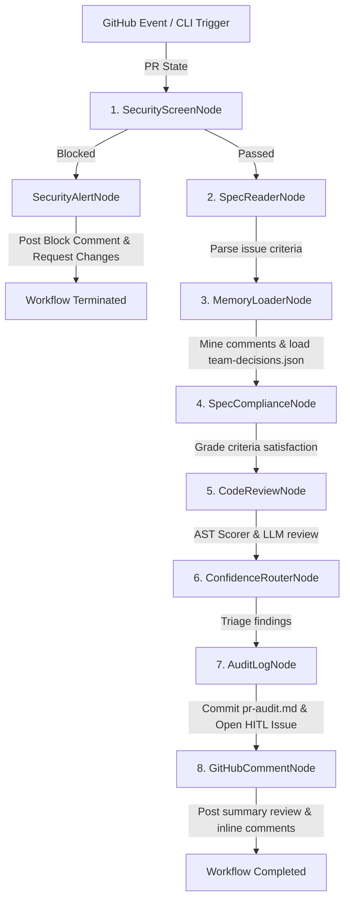

# 🔍 ReviewGuard — Confidence-Aware PR Verification Agent

[](LICENSE)
[](https://www.python.org/)
[](https://github.com/google/agent-development-kit)
[](https://docs.pydantic.dev/)
[](https://github.com/modelcontextprotocol/servers)

**ReviewGuard** is an enterprise-grade, memory-backed Pull Request verification agent built on the **Google Agent Development Kit (ADK) 2.0**.

ReviewGuard is not a generic code review bot. It is a **confidence-aware, memory-backed PR verification system** that enforces strict acceptance criteria compliance (criterion-by-criterion), integrates past team review decisions to prevent re-litigation of settled topics, runs pre-LLM security gates (secrets, prompt injection, PII), and gates all outputs through a deterministic confidence router, providing structured audit logs and Human-in-the-Loop (HITL) escalations.

## 💡 The Core Problem & Solution

### ⚠️ The Problem
Standard pull request code review bots suffer from three fatal flaws:
* **Noisy Vibes-Based Reviews**: They check diffs against generic guidelines rather than verifying whether the code actually satisfies the specific acceptance criteria defined in the linked GitHub Issue.
* **Litigating Settled Decisions**: They repeatedly flag issues (like code styling or specific architectural choices) that the team has already discussed, agreed upon, and consciously settled in past PR threads.
* **Unchecked LLM Access & Security Leaks**: They send code diffs containing API keys or PII directly to LLM APIs, exposing sensitive secrets and leaving systems open to prompt injection attacks in PR descriptions.

### 🛡️ The Solution
ReviewGuard introduces a secure, structured, memory-backed multi-agent PR review workflow:
* **Spec Compliance Accuracy**: Parses the linked GitHub Issue and checks the PR diff criterion by criterion, grading compliance as `SATISFIED`, `PARTIAL`, or `MISSING`.
* **Mined Team Memory**: Reads a bootstrap file (`team-decisions.json`) and mines closed PR comment histories to learn team preferences, automatically suppressing findings that match resolved topics.
* **Pre-LLM Security Screening Gate**: A zero-cost regex guardrail runs before any LLM API calls, blocking AWS keys, GitHub tokens, prompt injections, PII, and private IPs.
* **Confidence-Gated Outputs**: Automatically posts high-confidence reviews as inline comments, while routing low-confidence findings to a separate GitHub issue for human verification (HITL).

---

## ⚙️ System Architecture

ReviewGuard is orchestrated as a 7-node ADK 2.0 Workflow graph. It receives PR details from GitHub Actions, fetches files, consults the memory store, executes the review pipeline, and outputs results.

### 🖼️ System Design Architecture



### Core Nodes Detailed Breakdown

*   **`SecurityScreenNode`**: Runs pure Python regex guardrails. Scans for AWS secrets, GitHub OAuth keys, generic credentials, PII (SSNs, emails, phones, credit cards), private IP address leaks, and prompt injections in PR bodies.
*   **`SpecReaderNode`**: Identifies the linked GitHub Issue number in the PR description, fetches the issue body via the GitHub Model Context Protocol (MCP) server, and cleans it into a list of acceptance criteria.
*   **`MemoryLoaderNode`**: Loads historical team decisions and mines comments from closed PRs to build a list of team rules. It automatically updates `pattern-history.json` and flags stale rules older than 366 days.
*   **`SpecComplianceNode`**: Compares the code changes against the acceptance criteria, assessing compliance levels (`SATISFIED`, `PARTIAL`, `MISSING`), locating line references, and generating reasoning.
*   **`CodeReviewNode`**: Executes the `complexity_scorer` skill to analyze AST cyclomatic complexity and nesting depth, and reviews code changes against memory rules (suppressing guidelines that the team settled).
*   **`ConfidenceRouterNode`**: Deterministically routes findings based on LLM confidence scores. High-confidence issues are staged for direct PR posting; low-confidence findings are routed to a human-in-the-loop (HITL) escalation queue.
*   **`AuditLogNode`**: Commits a structured audit report (`review-artifacts/YYYY-MM-DD/pr-<id>.md`) to the repository and opens a HITL issue if any low-confidence warnings were routed.
*   **`GitHubCommentNode`**: Posts the final review verdict (`COMMENT` or `REQUEST_CHANGES`) alongside a Markdown summary table and inline comment suggestions.

---

## ⚙️ Tech Stack & Skills

*   **Orchestration**: Google Agent Development Kit (ADK 2.0), Pydantic v2, FastAPI.
*   **AI Inference & LLM Gateways**: Google Gemini (`gemini-2.5-flash`), Groq (`llama-3.3-70b-versatile`), and OpenRouter API (`gemma-2-9b-it`, `llama-3.3-70b-instruct`) fallback router.
*   **Repository Interaction**: Model Context Protocol (MCP) GitHub server connection.
*   **Custom Agent Skills**:
    *   **[`complexity_scorer`]**: Python `ast` syntax-tree analysis parsing cyclomatic complexity and code structures.
    *   **[`spec_compliance_checker`]**: Clean extractor of acceptance criteria from issue bodies.
    *   **[`commit_pattern_analyzer`]**: Semantic miner extracting code guidelines from closed PR comments.

---

## 🛠️ System Design & SOLID Patterns

*   **Saga / Eventual Consistency**: State progresses sequentially from node to node in `AgentState`. If any intermediate node fails, a tracking wrapper catches the exception, terminates gracefully, and writes an execution log to `artifacts/logs/` containing the exact diagnostic traceback.
*   **Single Responsibility Principle (SRP)**: Delineated node structures-e.g., `SecurityScreenNode` is solely responsible for input safety and contains zero LLM dependency, while `ConfidenceRouterNode` focuses exclusively on routing logic.
*   **Open/Closed Principle (OCP)**: Multi-provider LLM gateway (`llm_client.py`) uses a fallback-chain structure. Adding support for another inference engine (e.g. Anthropic) only requires registering a new provider class without modifying the nodes.
*   **Dependency Inversion (DIP)**: Nodes query GitHub repository details exclusively using the GitHub MCP client layer, decoupling code verification logic from raw API request libraries.

---

## 🚀 Local Setup & Configuration Guide

### 1. Prerequisites
*   **Python 3.14** (or Python 3.10+)
*   **make** (build utility)
*   **uv** (recommended fast package installer)

### 2. Environment Variables Configuration
Duplicate the example environment template in the project root:
```bash
cp .env.example .env
```
Open `.env` and fill out the keys:
```env
GEMINI_API_KEY=your_gemini_api_key_here
GITHUB_TOKEN=your_github_personal_access_token
GROQ_API_KEY=your_groq_api_key
OPENROUTER_API_KEY=your_openrouter_api_key
REVIEWGUARD_MOCK=false
PR_NUMBER=17
PR_TITLE="feat: Add idempotency key support"
PR_BODY="Implements idempotency key. Fixes #15"
REPO_OWNER=your_github_username
REPO_NAME=demo-paymentservice
```

### 3. Dependency Installation
Install package dependencies in a local virtual environment:
```bash
make install
```

### 4. Makefile Developer Shortcuts

| Command | Action |
|---------|--------|
| `make install` | Creates virtualenv and installs package dependencies |
| `make lint` | Runs formatting and import audits |
| `make playground` | Launches the interactive Google ADK Developer UI |
| `make playground-mock` | Launches the UI in mock mode (no API calls, reads local JSON datasets) |
| `make eval-traces` | Runs the 4 mock evaluation scenarios and generates traces |

---

## 🧪 Scenario Evaluation Suite

ReviewGuard includes an automated evaluation trace runner that tests the agent's logic across 4 scenarios:
1.  **`good_pr_001`**: A clean, fully-compliant PR.
2.  **`partial_pr_001`**: PR containing merge blockers (hardcoded TTL, retry violations, missing tests).
3.  **`injection_pr_001`**: Prompt injection payload in the description.
4.  **`secret_leak_001`**: PR diff containing a hardcoded GitHub Token leak.

To run the offline evaluation suite:
```bash
make eval-traces
```
This executes the scenarios, verifies the security and routing compliance, and writes trace output logs directly to `artifacts/traces/generated_traces.json`.

---

## 🔒 Security & Standards Compliance

### OWASP Top 10 Mitigations
*   **A01: Broken Access Control**: Scopes repository reading and issue writing permissions dynamically using repository metadata.
*   **A02: Cryptographic Failures**: Never logs raw secrets. Scans for exposed API keys and redacts them in the pre-LLM security gate.
*   **A03: Injection**: Employs pure regular expressions to block prompt injections in PR descriptions and code diff inputs.

### NIST SP 800-53 Control Mapping
*   **AC-3 (Access Enforcement)**: Enforces code check boundaries, preventing arbitrary repository mutation.
*   **AU-2 (Event Logging)**: Generates a persistent audit log (`review-artifacts/`) mapping exactly which criteria passed, failed, or were bypassed.
